<div align="center">



</div>

<br>

<table>
<tr>
<td width="58%" valign="top">

## `whoami`

**Software Engineer · Backend & Distributed Systems**

I build backend systems, web applications, data pipelines and cloud infrastructure.

</td>
<td width="42%" valign="top">

### `focus`

```text
backend / distributed
AI / agents
web / product
cloud / infrastructure
data / ETL
```

</td>
</tr>
</table>

<br>

## `what i'm building`

<table>
<tr>
<td width="50%" valign="top">

### `EONOM`

An **Airbnb-like platform** I am building.

<a href="https://eonom.com"></a>

**Web:** Next.js / React  
**Application:** NestJS / Prisma / PostgreSQL

Listings, bookings, wishlists, reviews, messaging, promotions, recommendations, payments, notifications and events.

[**eonom.com**](https://eonom.com)

</td>
<td width="50%" valign="top">

### `BLESSHMS`

A **hospital management system** split into separate frontend and backend applications.

<a href="https://blesshms.com"></a>

**Frontend:** Next.js / React  
**Backend:** NestJS / PostgreSQL

Patients, appointments, prescriptions, billing, inventory, labs, optics, analytics, administration, RBAC, audit trails, backups and cloud synchronization.

[**blesshms.com**](https://blesshms.com)

</td>
</tr>
</table>

```text
                    PRODUCTS
                       │
          ┌────────────┴────────────┐
          │                         │
        EONOM                  BLESSHMS
          │                         │
     ┌────┴────┐              ┌─────┴─────┐
     │         │              │           │
     UI       API            UI          API
     │         │              │           │
   Next.js   NestJS         Next.js     NestJS
                │                         │
             Prisma /                  TypeORM /
             PostgreSQL                PostgreSQL
```

<br>

## `stack`

<table>
<tr>
<td width="33%" align="center">

**BACKEND**

  

Python · Django · DRF  
Node.js · NestJS  
REST · GraphQL

</td>
<td width="33%" align="center">

**SYSTEMS**

  

AWS · GCP · Terraform  
SQS · Lambda · BigQuery  
Event-driven architecture

</td>
<td width="33%" align="center">

**DATA**

  

PostgreSQL · MongoDB  
Prisma · TypeORM · dbt  
ETL · APIs · SFTP

</td>
</tr>
</table>

<br>

## `production`

```text
millions of records
        │
        ▼
   event pipelines ────────→ APIs ────────→ external systems
        │                     │                    │
        ▼                     ▼                    ▼
     queues                auth / RBAC          webhooks
        │                     │                    │
        └──────────────→ observability ←──────────┘
                              │
                              ▼
                         failure happens
                              │
                              ▼
                         design for it
```

4+ years working across fintech, logistics and royalty accounting, building backend platforms, event pipelines, integrations, cloud infrastructure and data systems.

<br>

## `currently`

**AI agents** · **LLM systems** · **developer tooling**  
**backend architecture** · **automation** · **web applications**  
**data systems** · **distributed systems**

<br>

<div align="center">

`BUILD` &nbsp;→&nbsp; `BREAK` &nbsp;→&nbsp; `UNDERSTAND` &nbsp;→&nbsp; `REPEAT`

<br><br>

<sub>still building.</sub>

</div>
