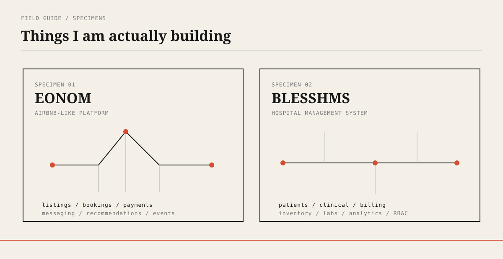
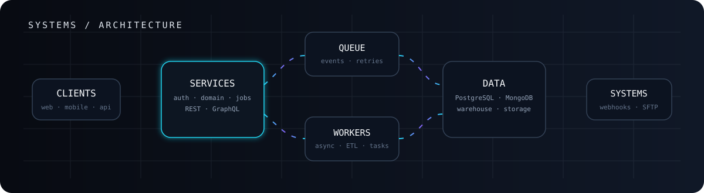
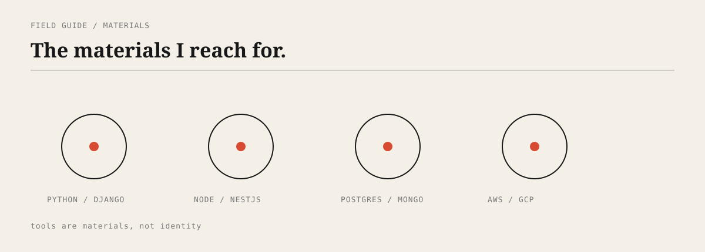
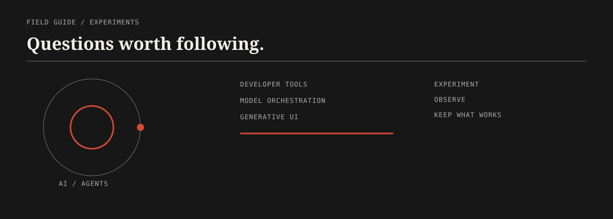

## `SPECIMENS`

EONOM is an Airbnb-like platform I am building. BLESSHMS is a hospital management system split across frontend and backend applications.

[**EONOM**](https://eonom.com) · [**BLESSHMS**](https://blesshms.com)

## `METHOD`

I build backend systems, web applications, data pipelines and cloud infrastructure, with production experience across fintech, logistics and royalty accounting.

## `MATERIALS`

Python · Django · DRF · Node.js · NestJS · React · Next.js · PostgreSQL · MongoDB · Prisma · TypeORM · AWS · GCP · Terraform · SQS · Lambda · BigQuery · dbt · ETL · APIs · SFTP

## `EXPERIMENTS`

AI agents · LLM systems · developer tooling · model orchestration · generative UI

## `NOTES`

## `END`

