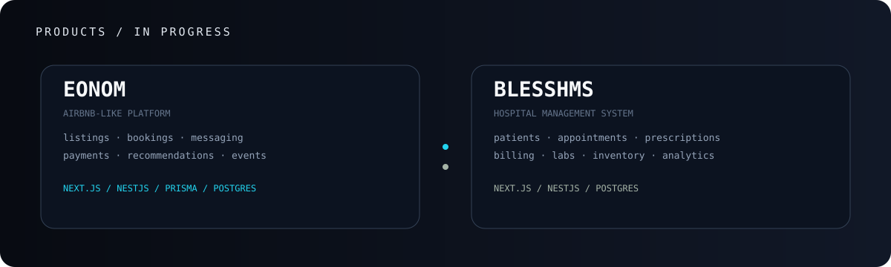
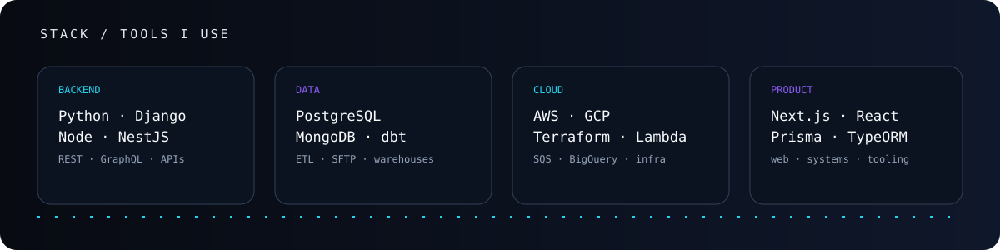
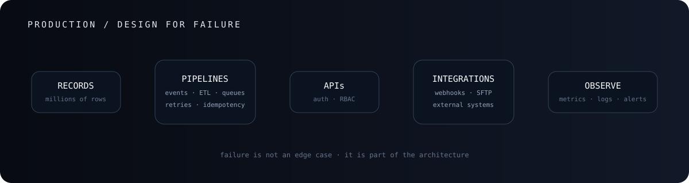
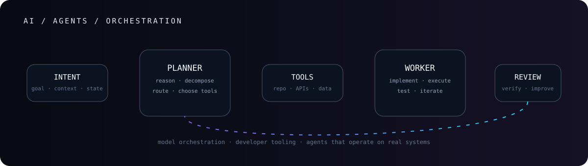
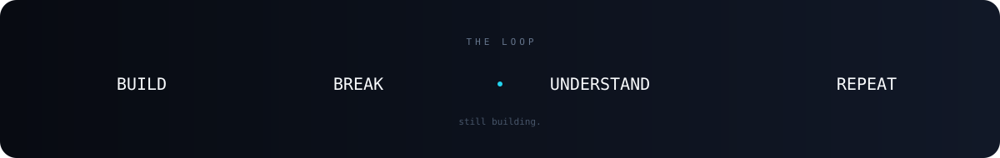

 

## `whoami`

**Software Engineer · Backend & Distributed Systems**

I build backend systems, web applications, data pipelines and cloud infrastructure.

 

## `what i'm building`

&nbsp;&nbsp;&nbsp;

**EONOM** is an Airbnb-like platform I am building. Next.js / React on the web, NestJS / Prisma / PostgreSQL in the application layer, with listings, bookings, wishlists, reviews, messaging, promotions, recommendations, payments, notifications and events.

**BLESSHMS** is a hospital management system split into separate frontend and backend applications. Next.js / React on the frontend, NestJS / PostgreSQL on the backend, covering patients, appointments, prescriptions, billing, inventory, labs, optics, analytics, administration, RBAC, audit trails, backups and cloud synchronization.

[**eonom.com**](https://eonom.com) · [**blesshms.com**](https://blesshms.com)

 

## `stack`

 

## `production`

4+ years working across fintech, logistics and royalty accounting, building backend platforms, event pipelines, integrations, cloud infrastructure and data systems.

 

## `currently`

AI agents · LLM systems · developer tooling  
backend architecture · automation · web applications  
data systems · distributed systems

 

